# **dash_plotly_demo_01**

## **Creating an interactive plot website with Plotly/Dash**

### **Ⅰ. Purpose** 

In data visualization, interactive plots can provide users with more information on interesting data. The content of this project is a demo to quickly build an interactive plot website mainly with Plotly/Dash for the investment statistics of top ETFs in Taiwan.  

### **Ⅱ. Tools**

Front-End: Plotly/Dash, Flask-Login   
Back-End: FastAPI, PostgreSQL  
Other: Selenium, Beautiful Soup, Docker, n8n  
 

### **Ⅲ. Statement** 

__1. The main components of this website__  

This interactive plot website has side-menu with five options. Only 3 options will be explained. 

__● Option - Financial Info (ETF)__ 

There are 8 tabs for this option. 
(1)Introduction: just a brief description about this study. 
(2)Overview: a dashboard with metrics, charts, and table. 
(3)Distribution by Industry: industry leaders by market value of ETFs in a treemap chart. 
(4)Holding(%) of ETF: a scatter plot with top holding-percentage stocks 
(5)Top 30 Stocks: choose date and ETF code to view top 30 stocks of its portfolio. 
(6)Trend-01: line charts for ETF historical prices and for stock holding amount and percentage of both selected ETF and stock code. 
(7)Trend-02: 2 subplots with line charts for stock historical prices and for ETFs holding amount after submiting options. 
(8)Individual Stocks: show basic information and holding in ETFs of selected stock. 

__● Option - Data Status (DB)__ 

Just display tables for checking whether data is inserted successfully or completely. 

__● Option - Auth (users)__ 

It's User Management. 

 

__2. Data__  

(1)Source  
Thanks for the website, "https://www.pocket.tw/etf/", provided by Pocket Securities. This company, one of the best Online Brokers in Taiwan, delivers high-quality services to customers, and its website makes it easier for investors to obtain financial data and useful information. 

(2)Web scraping 
The targeted data is the holding details, like stocks, bonds and so on, of exchange-traded fund (ETF) in Taiwan. The ETFs are selected according to the standard that they primarily invest in stocks and their asset value is more than one hundred billion (TWD). Therefore, 8 ETFs are selected in this project. Their security codes are '0050', '00878', '0056', '00919', '00929', '006208', '00940' and '00713' respectively. 
In addition, the information about ETF ranking by asset value, trading volume and so on, in Taiwan can be read on the website, Yahoo Finance (Taiwan). (Please refer to [details](<https://tw.stock.yahoo.com/tw-etf/total-assets>)) 
Besides, web scraping is primarily implemented by "Selenium" and "Beautiful Soup", and then data is saved into database. These tasks are built in a workflow by "n8n", as the workflow of ETF tools like Airflow or DolphineScheduler, scheduling and monitoring task execution. As you can see below. 

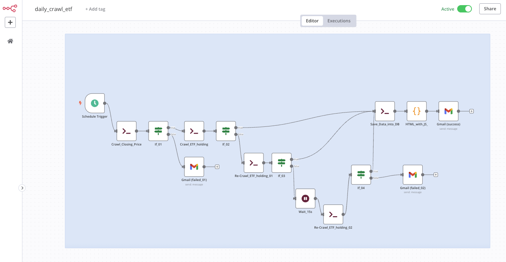
  

__3. How programming works__  

The data visualization platform, namely interactive plot website, is built in three parts. 
(1)Dash/Plotly is in charge of creating interactive plot. (Please refer to the folder  "[app_plotly](./app_plotly)") 
(2)FastAPI gets data from the database, PostgreSQL, and then processes metrics, charts, and tables. (Please refer to the folder  "[app_fastapi](./app_fastapi)") 
(3)The workflow of n8n, as just mentioned, operates periodically for crawling data from the website and saving data into database. The node "Gmail" in workflow will inform the results regardless of whether the workflow executed successfully or not.(Please refer to the similar project  [[n8n_py_js_demo_01](<https://github.com/qinglian1105/n8n_py_js_demo_01>)]) 

 

__4. Results__  

__● Page - Login__  

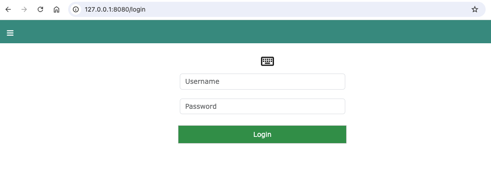
  

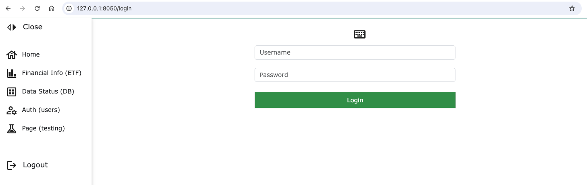
  

__● Option - Financial Info (ETF)__  

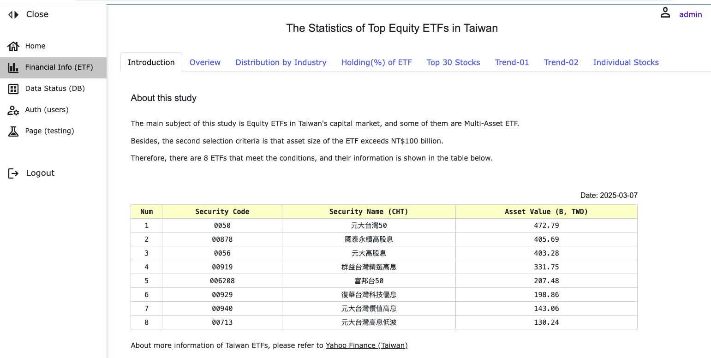
  

(1)Introduction 

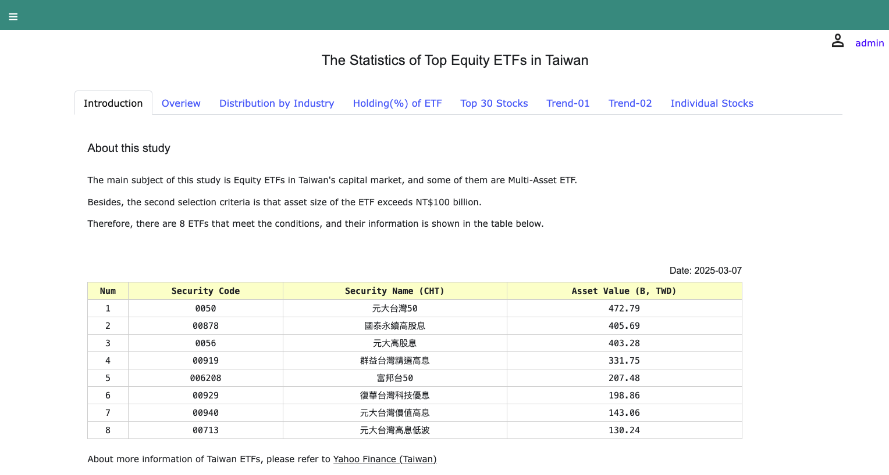
  

(2)Overview: a date picker to choose date for metrics, charts and tables. 

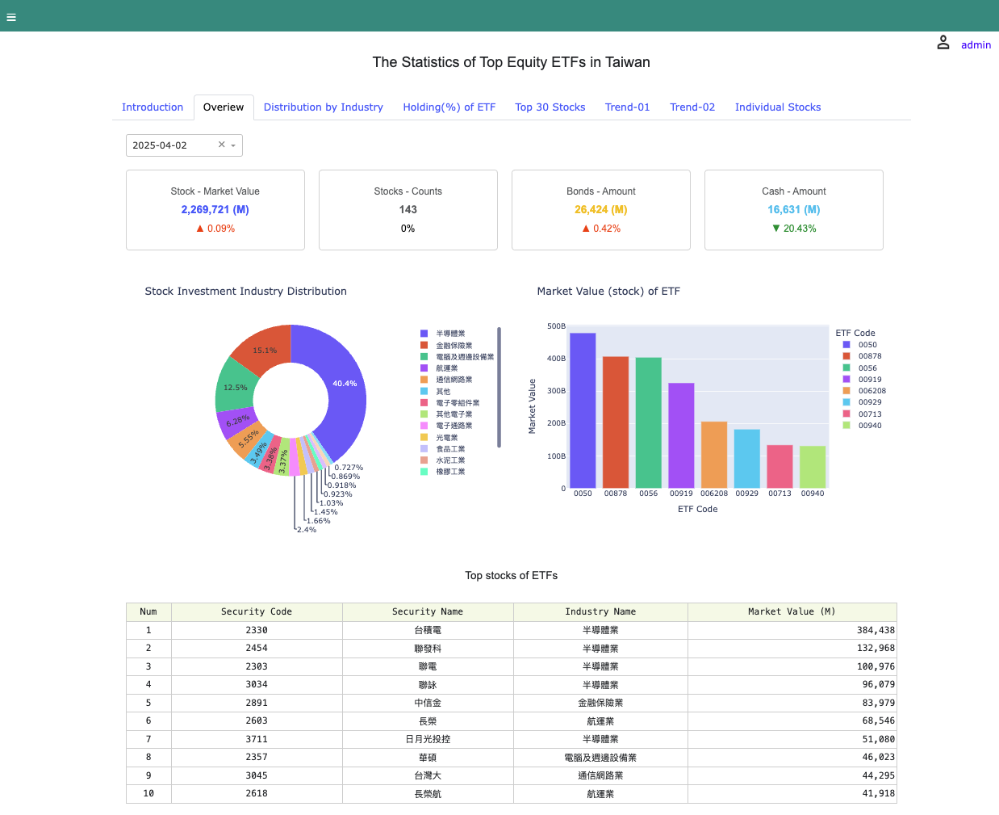
  

(3)Distribution by Industry: a treemap chart indicates the distribution by industry based on market value of top ETFs holding. Please note that this is not a true ranking of industries.  

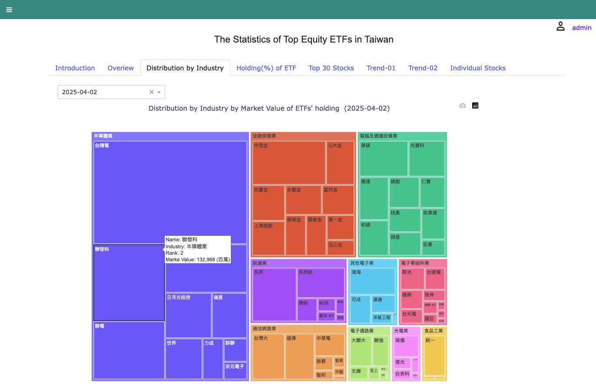
  

(4)Holding(%) of ETF: a scatter plot shows top holding of every ETF with percentage. 

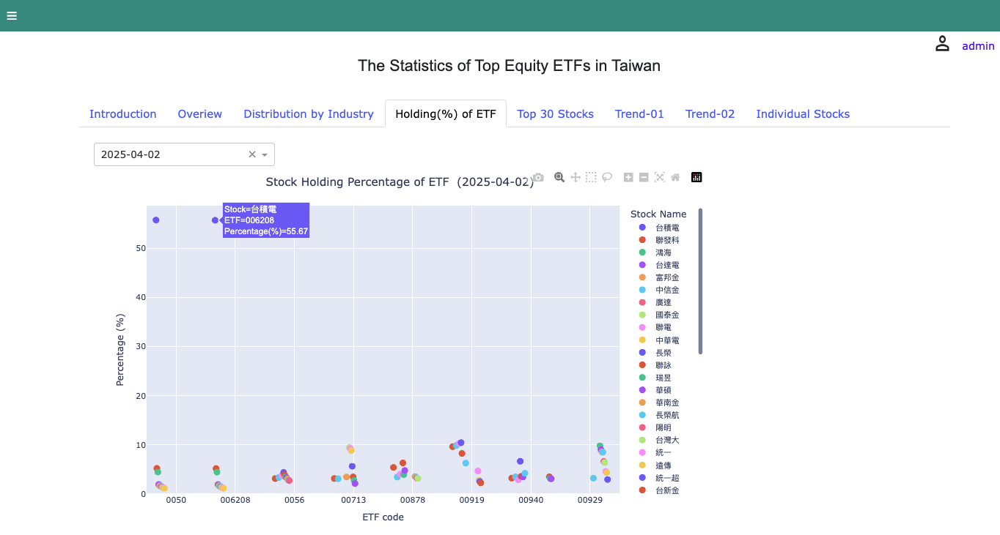
  

In addition, you can click on a stock name in the chart legend, such as "台積電", to temporarily not display it on the chart, making other stocks clearly visible. 

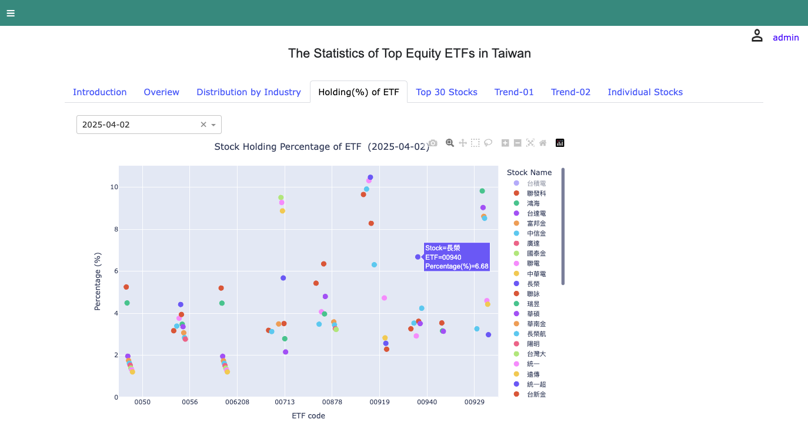
  

(5)Top 30 Stocks: as mentioned above. 

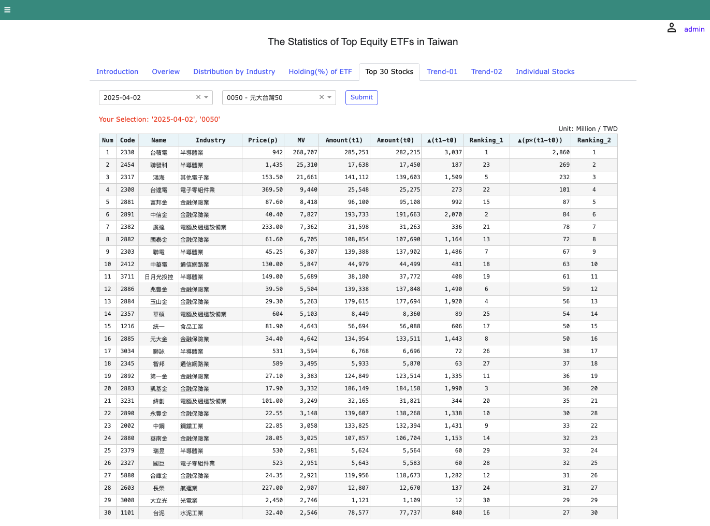
  

(6)Trend-01: as mentioned above. 

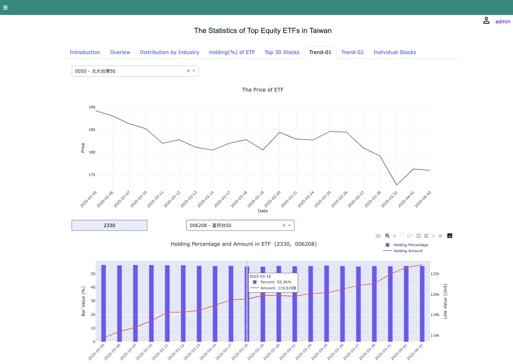
  

(7)Trend-02: as mentioned above. 

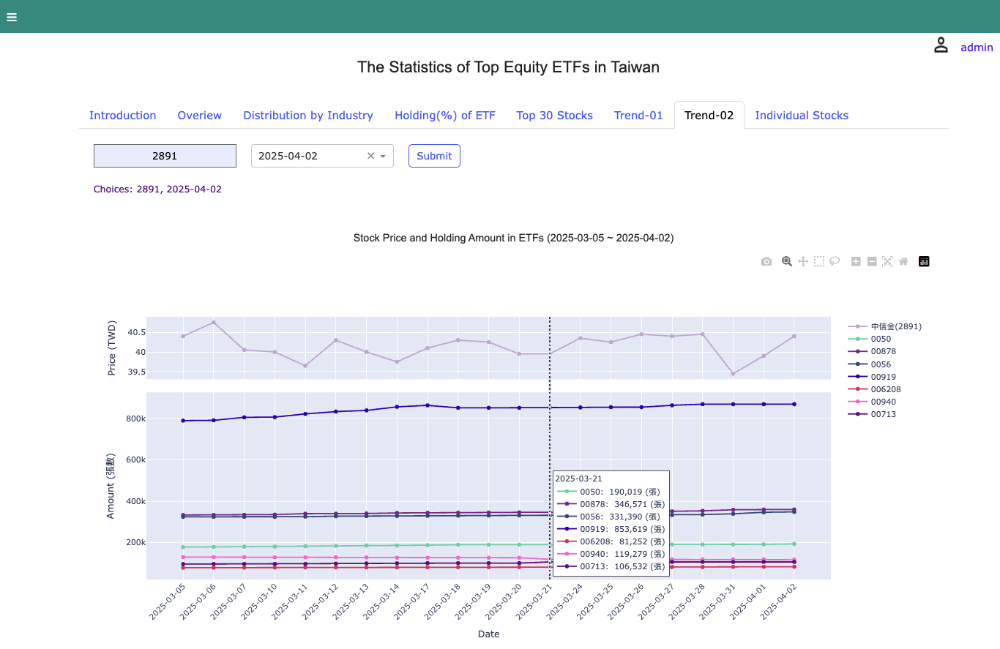
  

(8)Individual Stocks: show basic information and holding in ETFs after submitting stock code in the box. 

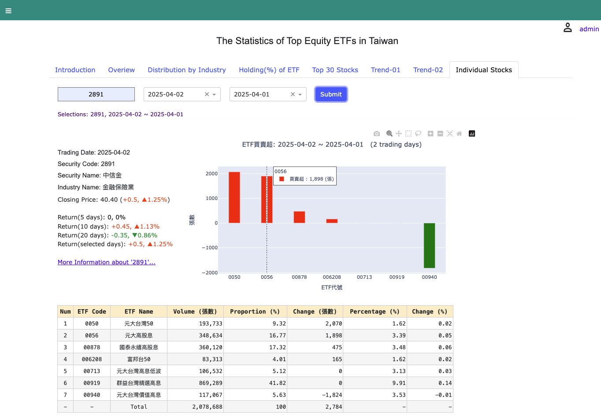
  

Besides, "More information about 'stock code'..." has a tooltip for clicking links to view more statistics or advanced analysis of that stock on the internet. 

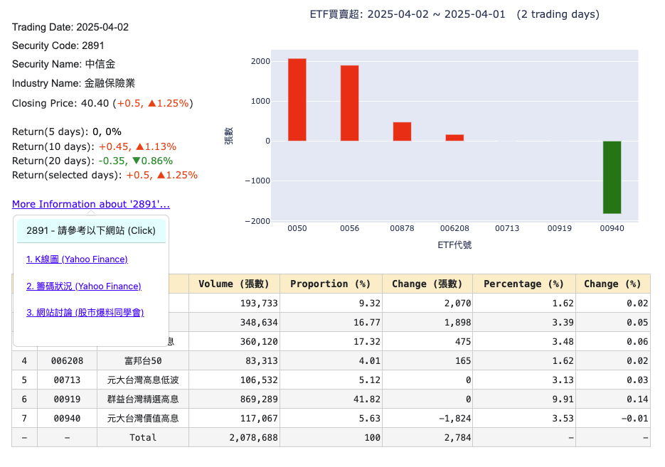
  

__● Option - Data Status (DB)__  

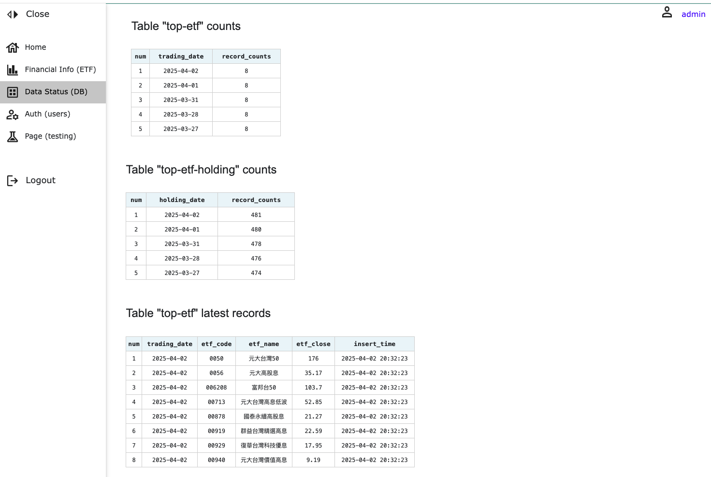
  

__● Option - Auth (users)__  

Only authorized personnel can add new users, remove users, update information of users. Besides, Using 'Update' to revise the content of coloum 'Authority' can control users for accessible pages.  

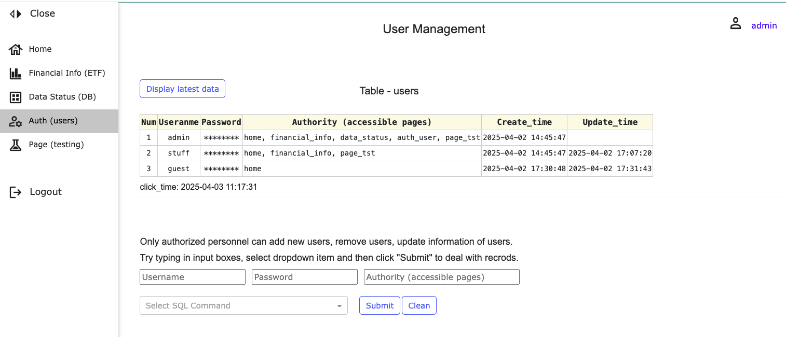
  

__The above offers an interactive plot website or data visualization platform with Plotly/Dash, FastAPI and n8n for investment statistics.__  

 

---

### **Ⅳ. References**

[1] [Dash Python User Guide](<https://dash.plotly.com/>)

[2] [Dash Enterprise App Gallery](<https://dash.gallery/Portal/>)

[3] [Github - plotly/dash](<https://github.com/plotly/dash>)

[4] [n8n](<https://n8n.io/>)

[5] [Yahoo Finance(Taiwan) - ETF asset ranking](<https://tw.stock.yahoo.com/tw-etf/total-assets>)

[6] [Pocket Securities - ETF](<https://www.pocket.tw/etf/>)

